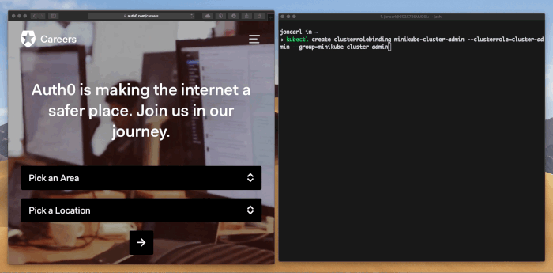

[![Build status][travisci-image]][travisci-url]
[![License][license-image]][license-url]
[![Go Report Card][go-report-card-image]][go-report-card-url]
[![Coverage Status][coveralls-image]][coveralls-url]

# k8s-pixy-auth
A kubectl plugin to authenticate against an OIDC compatible issuer using [PKCE (pixy) flow](https://auth0.com/docs/integrations/using-auth0-to-secure-a-cli)

As of Kubernetes v1.11 there is beta support for a [client-go credentials plugin](https://kubernetes.io/docs/reference/access-authn-authz/authentication/#client-go-credential-plugins). Using the support it is possible to use an Auth0 application to authenticate users and provide tokens with which a correctly configured Kubernetes cluster can authorize user actions.

## Installation
At this point in the project installation is manual. In the future this will be automated.
1. Make sure your Kubernetes api service is [configured to use OpenID Connect Tokens](https://kubernetes.io/docs/reference/access-authn-authz/authentication/#configuring-the-api-server).
2. Download a release binary or pull down this repo with `git clone git@github.com:auth0/k8s-pixy-auth.git`
3. If you pulled down the repo, change to the cloned directory and build the binary with `go build`
4. Initialize your kube config making sure to use the argument values applicable to your cluster `k8s-pixy-auth init --context-name "minikube" --issuer-endpoint "https://joncarl.auth0.com" --audience "minikube" --client-id "QXV0aDAgaXMgaGlyaW5nISBhdXRoMC5jb20vY2FyZWVycyAK"`. If you are using refresh tokens add `--with-refresh-token` to the command arguments. If you are using the ID Token instead of the Access Token add `--use-id-token` to the command arguments.
5. Run a command against Kubernetes like `kubectl get nodes`. Since this is the first time k8s-pixy-auth has been invoked for the context it will open a browser to authenticate you. 
6. After authentication is complete, switch back to your terminal and you should see the output of the command. If you don't have permissions it will let you know. Make sure you've correctly set up permissions for your user. After authentication is done k8s-pixy-auth will securely cache your the needed tokens.
7. Future commands will use the cached information from the first time you invoked k8s-pixy-auth for that context and will thus not require a browser to be opened each time. Because the auth tokens are stored securely the secure backend might ask for your credentials from time to time (the backend depends on OS).

## Securing the Credentials
[Keyring](https://github.com/99designs/keyring) is used in the background to secure the credentials. This allows cross-platform support to securely store the credentials.

## How to Configure Your Cluster
The k8s api service needs to be configured in order to use this tool. Checkout [Auth0Setup.md](docs/Auth0Setup.md) for a basic guide on how to setup Auth0 as the token issuer. Using that guide you should be able to set up other OIDC providers as well.

## Issue Reporting
If you have found a bug or if you have a feature request, please report them at this repository issues section. Please do not report security vulnerabilities on the public GitHub issue tracker. The [Responsible Disclosure Program](https://auth0.com/whitehat) details the procedure for disclosing security issues.

## Author

[Auth0](https://auth0.com)

## License

This project is licensed under the MIT license. See the [LICENSE](LICENSE) file for more info.

[travisci-image]: https://travis-ci.org/auth0/k8s-pixy-auth.svg?branch=master
[travisci-url]: https://travis-ci.org/auth0/k8s-pixy-auth
[license-image]: https://img.shields.io/github/license/auth0/k8s-pixy-auth.svg
[license-url]: #license
[go-report-card-image]: https://goreportcard.com/badge/github.com/auth0/k8s-pixy-auth
[go-report-card-url]: https://goreportcard.com/report/github.com/auth0/k8s-pixy-auth
[coveralls-image]: https://coveralls.io/repos/github/auth0/k8s-pixy-auth/badge.svg?branch=master
[coveralls-url]: https://coveralls.io/github/auth0/k8s-pixy-auth?branch=master
